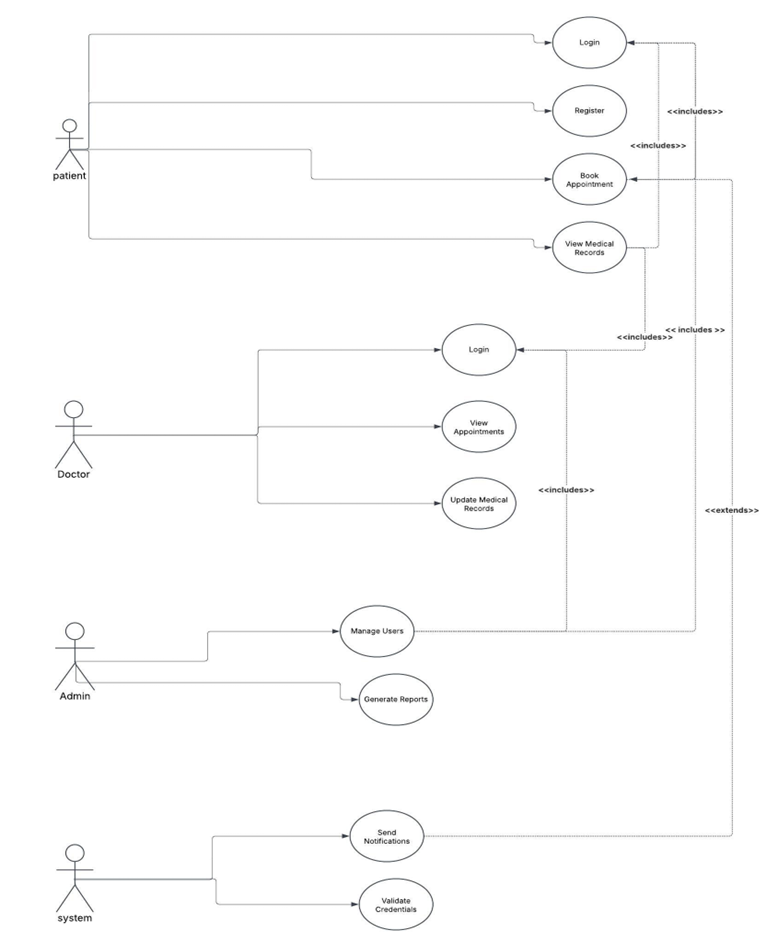
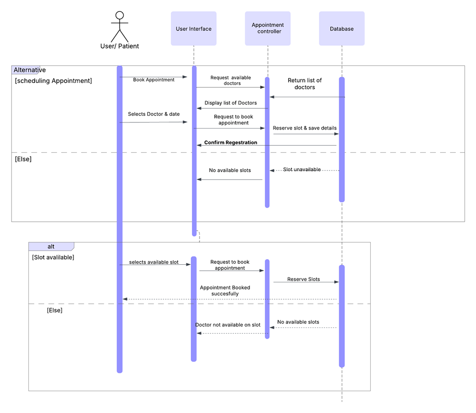
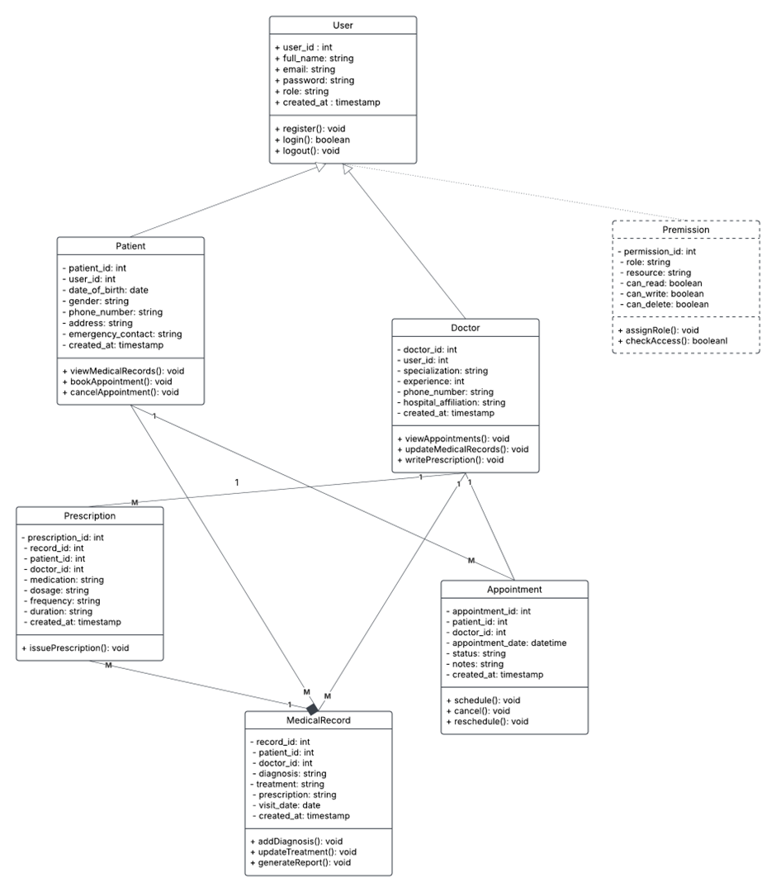
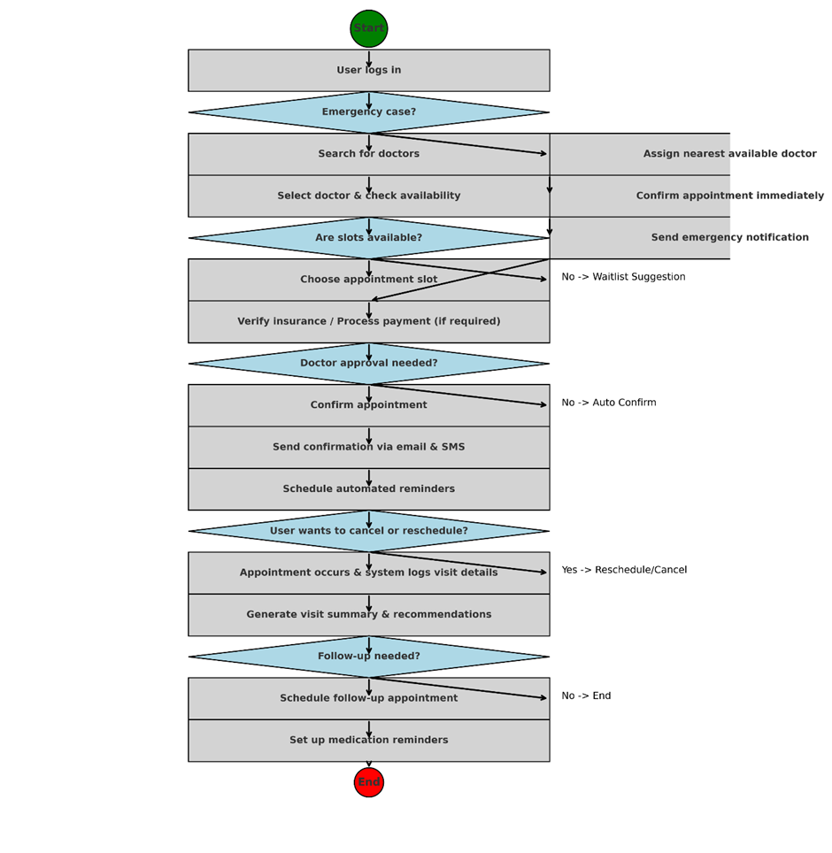

# SmartHealthcare - A Scalable & Intelligent Healthcare Platform

# Project Overview

SmartHealthcare is a secure, AI-powered healthcare management system designed for patients, doctors, hospitals, and researchers. It enables seamless patient-doctor interactions, AI diagnostics, secure health record management, telemedicine, and regulatory compliance (HIPAA/GDPR).

# Core Purpose

The SmartHealthcare website provides a scalable, secure, and intelligent platform to empower individuals to manage their health while enabling seamless communication with healthcare providers.

# Key Objectives

Seamless patient-doctor interaction via online appointment scheduling.
AI-powered health diagnostics for early disease detection.
Secure Electronic Health Records (EHRs) with role-based access control.
Telemedicine support for remote consultations.
HIPAA & GDPR compliance for secure data handling.

# Target Users & Their Needs


Patients : Book appointments, view health records, AI symptom checker, access telemedicine, receive reminders.

Doctors: Manage patients, schedule appointments, update health records, provide online consultations.

Hospitals & Clinics: Maintain centralized patient records, track staff availability, manage billing & insurance.

Healthcare Researchers: Access anonymized patient data for research & AI-driven health insights.

# Key Features

    User Authentication & Role-Based Access Control (RBAC)

    Secure login/signup using OAuth & JWT-based authentication.

    Role-based dashboards for Patients, Doctors, and Admins.

# Online Appointment Booking & Management

    Easy appointment scheduling, rescheduling, and cancellations.

    Doctors manage availability and patients get SMS & email reminders.


# Electronic Health Records (EHR) System

    Patients can securely view & download their complete medical history.

    Doctors can update and manage patient records efficiently.

# Telemedicine & Video Consultations

   Secure video calls for remote doctor consultations.

   AI-powered speech-to-text for medical notes automation.

# Admin Dashboard & Healthcare Analytics

   Manage users, appointments, and system settings.

   Real-time tracking of patient data and hospital resources.

# Security & Compliance

   End-to-end encryption for all medical data.


# Tech Stack

   Frontend:
   Framework: React.js
   UI Library: Bootstrap
   Authentication: JWT

   Backend (API & Logic Layer):
   Framework: Node.js, Express.js
   Database: MySQL

# Additional Integrations:

 Payment Gateway: Stripe

# Wireframe & UI Mockups

-> Wireframes & UI designs will be created using Figma.
-> User-friendly dashboards for patients, doctors, and admins.
-> Mobile responsive & intuitive navigation for accessibility.


# UML Diagrams


## 1️ Use Case Diagram
- The Use Case Diagram illustrates the interactions between different user roles (patients, doctors, and administrators) and the system functionalities.
- It highlights key use cases such as user registration, appointment booking, managing health records, and telemedicine consultations.



---

## 2 Sequence Diagram
- This sequence diagram illustrates the step-by-step process of user registration. It shows how a user interacts with the system by providing registration details through the User Interface.
- Below is the Sequence Diagram.


- This sequence diagram demonstrates how a patient books an appointment with a doctor. 
- It includes interactions where the patient selects a doctor, date, and time slot via the User Interface.


---


## 3 Class Diagram
- The Class Diagram represents the structure of the system by showing its classes, attributes, methods, and relationships.
- It includes key entities such as User, Patient, Doctor, Appointment, and MedicalRecord, along with their associations (e.g., one-to-many relationships between patients and appointments).
- Below is the Class Diagram.



---

## 4️ Activity Diagram

- The Activity Diagram represents the workflow of the system.
- Below is the Activity Diagram.




#  SmartHealthcare Database Design

## 1 Entity-Relationship Diagram (ERD)
The ERD below represents the database structure for the SmartHealthcare system.


## 2️ Database Tables and Schema
The SmartHealthcare database consists of the following tables:

###  i. users Table
- **Primary Key:** `user_id` (`INT`, `AUTO_INCREMENT`)
- **Attributes:** 
  - `full_name` (`VARCHAR`)
  - `email` (`VARCHAR`, `UNIQUE`)
  - `password` (`VARCHAR` - hashed with bcrypt)
  - `role` (`ENUM` - 'patient', 'doctor', 'admin')
  - `created_at` (`TIMESTAMP`)
- **No foreign keys**

###  ii. patients Table
- **Primary Key:** `patient_id` (`INT`, `AUTO_INCREMENT`)
- **Foreign Key:** `user_id` (`INT`, references `users.user_id`)
- **Attributes:** 
  - `date_of_birth` (`DATE`)
  - `gender` (`ENUM` - 'Male', 'Female', 'Other')
  - `phone_number` (`VARCHAR(10)`, `UNIQUE`)
  - `address` (`TEXT`)
  - `emergency_contact` (`VARCHAR(10)`)
  - `created_at` (`TIMESTAMP`)

###  iii. doctors Table
- **Primary Key:** `doctor_id` (`INT`, `AUTO_INCREMENT`)
- **Foreign Key:** `user_id` (`INT`, references `users.user_id`)
- **Attributes:** 
  - `title` (`VARCHAR`)
  - `department` (`VARCHAR`)
  - `experience` (`VARCHAR`)
  - `mobile` (`VARCHAR`)
  - `hospital_affiliation` (`VARCHAR`)
  - `created_at` (`TIMESTAMP`)

###  iv. appointments Table
- **Primary Key:** `appointment_id` (`INT`, `AUTO_INCREMENT`)
- **Foreign Keys:** 
  - `patient_id` (`INT`, references `patients.patient_id`)
  - `doctor_id` (`INT`, references `doctors.doctor_id`)
- **Attributes:** 
  - `appointment_date` (`DATETIME`)
  - `status` (`ENUM` - 'pending', 'confirmed', 'completed', 'cancelled')
  - `appointment_type` (`ENUM` - 'Consultation', 'Follow-up', 'New Patient')
  - `notes` (`TEXT`)
  - `created_at` (`TIMESTAMP`)

###  v. medical_records Table
- **Primary Key:** `record_id` (`INT`, `AUTO_INCREMENT`)
- **Foreign Keys:** 
  - `patient_id` (`INT`, references `patients.patient_id`)
  - `doctor_id` (`INT`, references `doctors.doctor_id`)
- **Attributes:** 
  - `diagnosis` (`TEXT`)
  - `prescription` (`TEXT`)
  - `visit_date` (`DATE`)
  - `created_at` (`TIMESTAMP`)

###  vi. scheduletimings Table
- **Primary Key:** `id` (`INT`, `AUTO_INCREMENT`)
- **Foreign Key:** `doctor_id` (`INT`, references `doctors.doctor_id`)
- **Attributes:** 
  - `weekday` (`VARCHAR(20)`)
  - `start_time` (`TIME`)
  - `end_time` (`TIME`)
  - `created_at` (`TIMESTAMP`)
  - `updated_at` (`TIMESTAMP`)

###  vii. invoices Table
- **Primary Key:** `invoice_id` (`INT`, `AUTO_INCREMENT`)
- **Foreign Keys:** 
  - `patient_id` (`INT`, references `patients.patient_id`)
  - `appointment_id` (`INT`, references `appointments.appointment_id`)
- **Attributes:** 
  - `amount` (`DECIMAL`)
  - `status` (`VARCHAR`)
  - `created_at` (`TIMESTAMP`)

###  viii. prescriptions Table (Optional - for future use)
- **Primary Key:** `prescription_id` (`INT`, `AUTO_INCREMENT`)
- **Foreign Keys:** 
  - `record_id` (`INT`, references `medical_records.record_id`)
  - `patient_id` (`INT`, references `patients.patient_id`)
  - `doctor_id` (`INT`, references `doctors.doctor_id`)
- **Attributes:** 
  - `medication` (`VARCHAR`)
  - `dosage` (`VARCHAR`)
  - `frequency` (`VARCHAR`)
  - `duration` (`VARCHAR`)
  - `created_at` (`TIMESTAMP`)

###  ix. permissions Table (Optional - for future use)
- **Primary Key:** `permission_id` (`INT`, `AUTO_INCREMENT`)
- **No foreign keys**
- **Attributes:** 
  - `role` (`VARCHAR`)
  - `resource` (`VARCHAR`)
  - `can_read` (`BOOLEAN`)
  - `can_write` (`BOOLEAN`)
  - `can_delete` (`BOOLEAN`)

---

##  3️  SQL Queries
Below are some sample queries demonstrating key functionalities of the SmartHealthcare database.

###  → Retrieve all appointments for a specific patient
```sql
SELECT 
    a.appointment_id, 
    a.appointment_date, 
    a.status, 
    a.appointment_type,
    u.full_name AS doctor_name,
    d.department AS doctor_department
FROM appointments a
JOIN doctors d ON a.doctor_id = d.doctor_id
JOIN users u ON d.user_id = u.user_id
WHERE a.patient_id = 1
ORDER BY a.appointment_date DESC;
```

###  → List all doctors with their departments and experience
```sql
SELECT 
    u.full_name, 
    d.title,
    d.department, 
    d.experience,
    d.hospital_affiliation
FROM doctors d 
JOIN users u ON d.user_id = u.user_id 
ORDER BY d.experience DESC; 
```

###  → Get patient profile with user information
```sql
SELECT 
    p.patient_id,
    u.full_name,
    u.email,
    p.date_of_birth,
    p.gender,
    p.phone_number,
    p.address,
    p.emergency_contact
FROM patients p
JOIN users u ON p.user_id = u.user_id
WHERE p.user_id = ?;
```

###  → Get doctor's schedule timings
```sql
SELECT 
    weekday,
    start_time,
    end_time
FROM scheduletimings
WHERE doctor_id = ?
ORDER BY 
    FIELD(weekday, 'Monday', 'Tuesday', 'Wednesday', 'Thursday', 'Friday', 'Saturday', 'Sunday');
```

###  → Get upcoming appointments for a doctor
```sql
SELECT 
    a.appointment_id,
    a.appointment_date,
    a.status,
    a.appointment_type,
    u.full_name AS patient_name,
    p.phone_number AS patient_phone
FROM appointments a
JOIN patients p ON a.patient_id = p.patient_id
JOIN users u ON p.user_id = u.user_id
WHERE a.doctor_id = ?
    AND a.appointment_date >= NOW()
    AND a.status IN ('pending', 'confirmed')
ORDER BY a.appointment_date ASC;
```

###  → Get medical records for a patient
```sql
SELECT 
    mr.record_id,
    mr.visit_date,
    mr.diagnosis,
    mr.prescription,
    u.full_name AS doctor_name,
    d.department
FROM medical_records mr
JOIN doctors d ON mr.doctor_id = d.doctor_id
JOIN users u ON d.user_id = u.user_id
WHERE mr.patient_id = ?
ORDER BY mr.visit_date DESC;
```

###  → Count appointments by status for a patient
```sql
SELECT 
    status,
    COUNT(*) AS count
FROM appointments
WHERE patient_id = ?
GROUP BY status;
```

###  → Find available time slots for a doctor on a specific day
```sql
SELECT 
    weekday,
    start_time,
    end_time
FROM scheduletimings
WHERE doctor_id = ?
    AND weekday = ?;
```

###  → Get invoices for a patient
```sql
SELECT 
    i.invoice_id,
    i.amount,
    i.status,
    a.appointment_date,
    u.full_name AS doctor_name
FROM invoices i
JOIN appointments a ON i.appointment_id = a.appointment_id
JOIN doctors d ON a.doctor_id = d.doctor_id
JOIN users u ON d.user_id = u.user_id
WHERE i.patient_id = ?
ORDER BY i.created_at DESC;
```


# Contribution Guidelines

Steps to Contribute (For Collaborators)

1. Clone the repository

2. Create a feature branch

3. Make changes & commit

    git add .
    git commit -m "Added new feature"

4. Push to GitHub

    git push origin feature-branch-name

5. Create a Pull Request and request a review.


# 📄 License

This project is licensed under the MIT License – see the LICENSE file for details.


# Thank you for checking out SmartHealthcare! Let's make healthcare accessible, secure, and intelligent for everyone!
