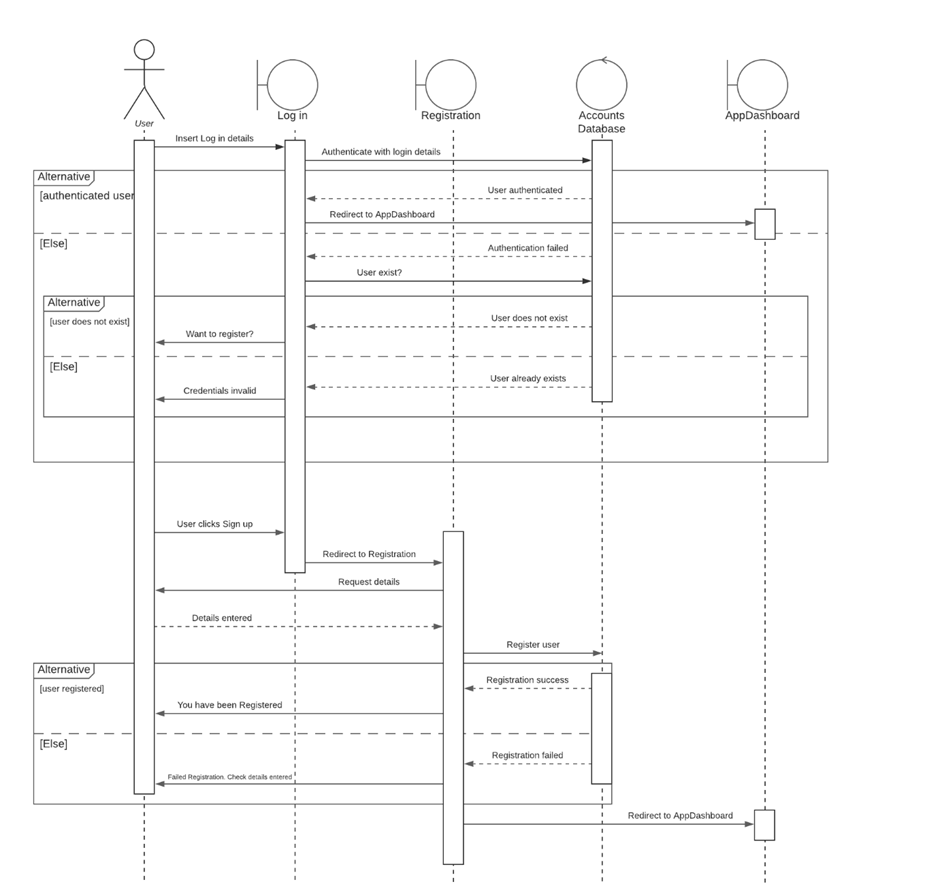
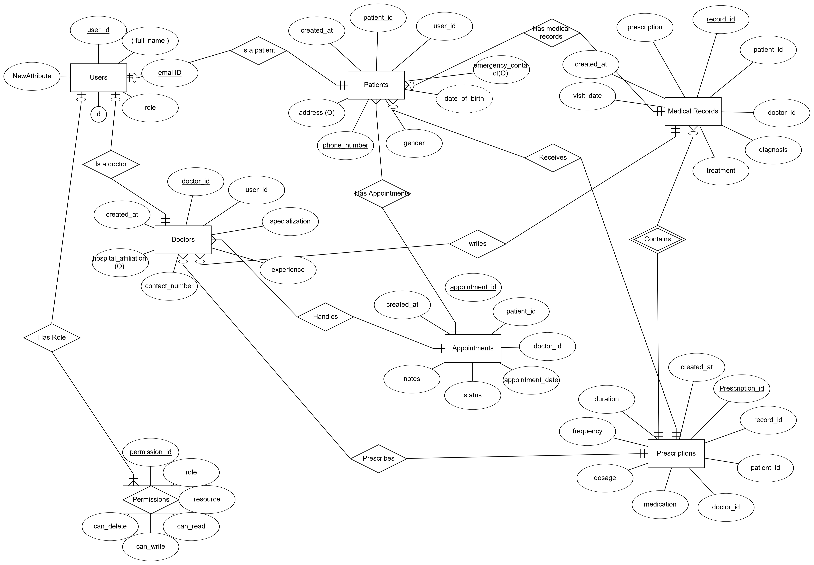

# SmartHealthcare - A Scalable & Intelligent Healthcare Platform

# Project Overview

SmartHealthcare is a secure, AI-powered healthcare management system designed for patients, doctors, hospitals, and researchers. It enables seamless patient-doctor interactions, AI diagnostics, secure health record management, telemedicine, and regulatory compliance (HIPAA/GDPR).

# Core Purpose

The SmartHealthcare website provides a scalable, secure, and intelligent platform to empower individuals to manage their health while enabling seamless communication with healthcare providers.

# Key Objectives

Seamless patient-doctor interaction via online appointment scheduling.
AI-powered health diagnostics for early disease detection.
Secure Electronic Health Records (EHRs) with role-based access control.
Telemedicine support for remote consultations.
HIPAA & GDPR compliance for secure data handling.

# Target Users & Their Needs


Patients : Book appointments, view health records, AI symptom checker, access telemedicine, receive reminders.

Doctors: Manage patients, schedule appointments, update health records, provide online consultations.

Hospitals & Clinics: Maintain centralized patient records, track staff availability, manage billing & insurance.

Healthcare Researchers: Access anonymized patient data for research & AI-driven health insights.

# Key Features

    User Authentication & Role-Based Access Control (RBAC)

    Secure login/signup using OAuth & JWT-based authentication.

    Role-based dashboards for Patients, Doctors, and Admins.

# Online Appointment Booking & Management

    Easy appointment scheduling, rescheduling, and cancellations.

    Doctors manage availability and patients get SMS & email reminders.


# Electronic Health Records (EHR) System

    Patients can securely view & download their complete medical history.

    Doctors can update and manage patient records efficiently.

# Telemedicine & Video Consultations

   Secure video calls for remote doctor consultations.

   AI-powered speech-to-text for medical notes automation.

# Admin Dashboard & Healthcare Analytics

   Manage users, appointments, and system settings.

   Real-time tracking of patient data and hospital resources.

# Security & Compliance

   End-to-end encryption for all medical data.


# Tech Stack

   Frontend:
   Framework: React.js
   UI Library: Bootstrap
   Authentication: JWT

   Backend (API & Logic Layer):
   Framework: Node.js, Express.js
   Database: MySQL

# Additional Integrations:

💳 Payment Gateway: Stripe

# Wireframe & UI Mockups

-> Wireframes & UI designs will be created using Figma.
-> User-friendly dashboards for patients, doctors, and admins.
-> Mobile responsive & intuitive navigation for accessibility.


# UML Diagrams


## 1️ Use Case Diagram
- The Use Case Diagram illustrates the interactions between different user roles (patients, doctors, and administrators) and the system functionalities.
- It highlights key use cases such as user registration, appointment booking, managing health records, and telemedicine consultations.


---

## 2 Sequence Diagram
- This sequence diagram illustrates the step-by-step process of user registration. It shows how a user interacts with the system by providing registration details through the User Interface.
- Below is the Sequence Diagram.



- This sequence diagram demonstrates how a patient books an appointment with a doctor. 
- It includes interactions where the patient selects a doctor, date, and time slot via the User Interface.


---


## 3 Class Diagram
- The Class Diagram represents the structure of the system by showing its classes, attributes, methods, and relationships.
- It includes key entities such as User, Patient, Doctor, Appointment, and MedicalRecord, along with their associations (e.g., one-to-many relationships between patients and appointments).
- Below is the Class Diagram.


---

## 4️ Activity Diagram

- The Activity Diagram represents the workflow of the system.
- Below is the Activity Diagram.


# 📌 SmartHealthcare Database Design

## 1 Entity-Relationship Diagram (ERD)
The ERD below represents the database structure for the SmartHealthcare system.




## 2️ Database Tables and Schema
The SmartHealthcare database consists of the following tables:

###  i. Users Table
- **Primary Key:** `user_id` (`INT`, `AUTO_INCREMENT`)
- **Attributes:** `full_name`, `email`, `password`, `role`, `created_at`
- **No foreign keys**

###  ii. Patients Table
- **Primary Key:** `patient_id` (`INT`, `AUTO_INCREMENT`)
- **Foreign Key:** `user_id` (references `Users` table)
- **Attributes:** `date_of_birth`, `gender`, `phone_number`, `address`, `emergency_contact`, `created_at`

###  iii. Doctors Table
- **Primary Key:** `doctor_id` (`INT`, `AUTO_INCREMENT`)
- **Foreign Key:** `user_id` (references `Users` table)
- **Attributes:** `specialization`, `experience`, `phone_number`, `hospital_affiliation`, `created_at`

###  iv. Appointments Table
- **Primary Key:** `appointment_id` (`INT`, `AUTO_INCREMENT`)
- **Foreign Keys:** `patient_id` (references `Patients` table), `doctor_id` (references `Doctors` table)
- **Attributes:** `appointment_date`, `status`, `notes`, `created_at`

###  v. Medical_Records Table
- **Primary Key:** `record_id` (`INT`, `AUTO_INCREMENT`)
- **Foreign Keys:** `patient_id` (references `Patients` table), `doctor_id` (references `Doctors` table)
- **Attributes:** `diagnosis`, `treatment`, `prescription`, `visit_date`, `created_at`

###  vi. Prescriptions Table
- **Primary Key:** `prescription_id` (`INT`, `AUTO_INCREMENT`)
- **Foreign Keys:** `record_id` (references `Medical_Records` table), `patient_id` (references `Patients` table), `doctor_id` (references `Doctors` table)
- **Attributes:** `medication`, `dosage`, `frequency`, `duration`, `created_at`

###  vii. Permissions Table
- **Primary Key:** `permission_id` (`INT`, `AUTO_INCREMENT`)
- **No foreign keys**
- **Attributes:** `role`, `resource`, `can_read`, `can_write`, `can_delete`

---

##  3️ Sample SQL Queries
Below are some sample queries demonstrating key functionalities of the SmartHealthcare database.

###  → Retrieve all appointments for a specific patient
```sql
SELECT a.appointment_id, a.appointment_date, a.status, u.full_name AS doctor_name
FROM Appointments a
JOIN Doctors d ON a.doctor_id = d.doctor_id
JOIN Users u ON d.user_id = u.user_id
WHERE a.patient_id = 1;
```
###  → List all doctors with their specializations and experience:

``` sql
SELECT u.full_name, d.specialization, d.experience 
FROM Doctors d 
JOIN Users u ON d.user_id = u.user_id 
ORDER BY d.experience DESC; 
```


# Contribution Guidelines

Steps to Contribute (For Collaborators)

1. Clone the repository

2. Create a feature branch

3. Make changes & commit

    git add .
    git commit -m "Added new feature"

4. Push to GitHub

    git push origin feature-branch-name

5. Create a Pull Request and request a review.


# 📄 License

This project is licensed under the MIT License – see the LICENSE file for details.


# Thank you for checking out SmartHealthcare! Let's make healthcare accessible, secure, and intelligent for everyone!
